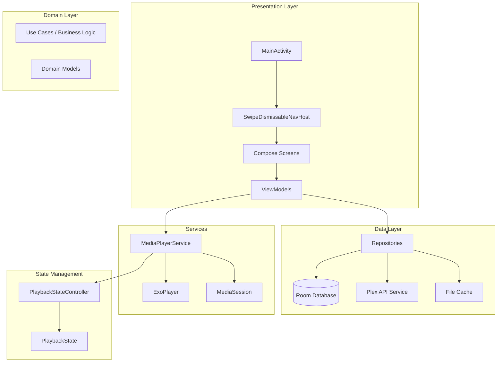
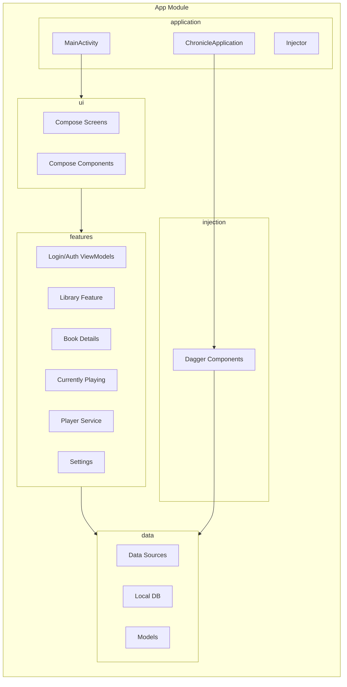

# Chronicle Architecture

## Overview

Chronicle is a standalone **Wear OS** audiobook player (Wear OS 6 / API 36, built with Pixel Watch
4 in mind) that integrates with Plex Media Server. It was converted in-place from an earlier
Android phone app: `:app` **is** the Wear OS app now, there is no phone app and no separate
`:wear` module. The app follows a layered MVVM architecture with clear separation between
Presentation, Domain/Business Logic, and Data layers.

This document provides a high-level overview of Chronicle's architecture. For detailed information
on specific topics, see the documentation links below. Several of the linked documents below
predate the Wear OS conversion and are marked STALE at the top of the file; where that matters,
prefer [`architecture/wear-platform.md`](architecture/wear-platform.md) and
[`../docs/features/wear-ui.md`](features/wear-ui.md) for what's current.

### Features cut for the Wear OS conversion

The following existed in the phone app and were deliberately not carried forward: Collections
browsing, a dedicated search screen, the Home "recently listened"/"recently added" rails, the
multi-account browsing UI and library-selector bottom sheet, the sort/view-style matrix, the
sync-location picker, the debug-info dialog, Play Billing/premium, the OSS licenses screen,
Android Auto, and Chrome Custom Tabs browser-based login (replaced by plex.tv/link — see
[Plex Sign-In](features/plex-link-login.md)). Two of these are more than UX trims and are worth
calling out on their own: **Play Billing removal is a business decision**, not a form-factor one,
and **there is no on-watch user switching** after the initial link — a Plex home/family account
gets whichever user the link flow resolves to, and changing that means re-running the link flow.
See [`docs/features/wear-ui.md`](features/wear-ui.md) for what was kept and built instead.

---

## Documentation Index

| Document | Description |
|----------|-------------|
| [Wear OS Platform](architecture/wear-platform.md) | Rotary input, Ongoing Activity, `AudioOutputMonitor`, storage constraints, what's out of scope |
| [Architecture Layers](architecture/layers.md) | Detailed description of Presentation, Domain, and Data layers |
| [Dependency Injection](architecture/dependency-injection.md) | Dagger 2 component hierarchy, modules, and scopes (STALE — phone-era; component shape is unchanged) |
| [Architectural Patterns](architecture/patterns.md) | Key patterns: Repository, MVVM, MediaBrowserService, State Machines (STALE — phone-era) |
| [Plex Integration](architecture/plex-integration.md) | Plex API integration, server connection selection, client profiles, bandwidth-aware playback (STALE — phone-era) |
| [Lazy Token Injection](architecture/lazy-token-injection.md) | ExoPlayer HTTP DataSource lazy token injection pattern to prevent stale auth tokens |
| [Library-Aware Playback](architecture/library-aware-playback.md) | Multi-library server resolution for playback |
| [Progress Reporting Overhaul](architecture/progress-reporting-overhaul.md) | Thread-safe, library-aware progress reporting with PlexProgressReporter |
| [Scoped Plex Service Factory](architecture/scoped-plex-service-factory.md) | Per-library request-scoped Retrofit/Plex service construction |
| [Plex Dashboard Activity](architecture/plex-dashboard-activity.md) | Plex "now playing" dashboard visibility (play queue item cache) |

---

## Architecture Diagram



---

## Component Diagram



---

## Layer Summary

| Layer | Location | Responsibility |
|-------|----------|----------------|
| **Presentation** | [`ui/`](../app/src/main/java/local/oss/chronicle/ui/) (Compose for Wear OS) + ViewModels in [`features/`](../app/src/main/java/local/oss/chronicle/features/) | UI, ViewModels, user interaction |
| **Domain** | ViewModels, Repositories | Business logic, data transformation |
| **Data** | [`data/`](../app/src/main/java/local/oss/chronicle/data/) | Storage, API calls, caching |
| **Services** | [`features/player/`](../app/src/main/java/local/oss/chronicle/features/player/) | Background audio playback |

→ See [Architecture Layers](architecture/layers.md) for detailed layer descriptions.

---

## Dependency Injection Summary

Chronicle uses Dagger 2 with a three-component hierarchy:

| Component | Scope | Purpose |
|-----------|-------|---------|
| [`AppComponent`](../app/src/main/java/local/oss/chronicle/injection/components/AppComponent.kt) | @Singleton | Application-wide dependencies |
| [`ActivityComponent`](../app/src/main/java/local/oss/chronicle/injection/components/ActivityComponent.kt) | @ActivityScope | Activity-scoped dependencies |
| [`ServiceComponent`](../app/src/main/java/local/oss/chronicle/injection/components/ServiceComponent.kt) | @ServiceScope | MediaPlayerService dependencies |

→ See [Dependency Injection](architecture/dependency-injection.md) for component hierarchy and module details.

---

## Key Patterns Summary

| Pattern | Purpose |
|---------|---------|
| **Repository** | Single source of truth combining local and remote data |
| **MVVM** | Separation of UI, state management, and data access |
| **MediaBrowserService** | Background playback, system media controls (Android Auto support was removed in the Wear OS conversion) |
| **State Machines** | Connection and login state management |
| **PlaybackStateController** | Single source of truth for playback state with StateFlow |
| **Retry with Exponential Backoff** | Resilient network operations with automatic retry |
| **Structured Error Handling** | Type-safe error categories via sealed classes |

→ See [Architectural Patterns](architecture/patterns.md) for detailed pattern implementations.

---

## Plex Integration Summary

Chronicle integrates with Plex Media Server for:
- Authentication via plex.tv — on Wear OS, the plex.tv/link short-code flow (see
  [Plex Sign-In](features/plex-link-login.md)) rather than the phone app's Chrome Custom Tabs
  browser redirect
- **Server connection selection** - Automatic selection from multiple URIs (local, remote, relay)
- Library browsing and metadata
- Audio streaming with bandwidth-aware playback
- Playback position sync

→ See [Plex Integration](architecture/plex-integration.md) (STALE — phone-era, but the server
connection/streaming details are largely unchanged) and [Plex Sign-In](features/plex-link-login.md)
(current, Wear-specific) for API details and implementation.

---

## Account Management

Chronicle's data layer still supports multiple Plex accounts and libraries
([`AccountManager`](../app/src/main/java/local/oss/chronicle/features/account/AccountManager.kt),
[`AccountRepository`](../app/src/main/java/local/oss/chronicle/data/local/AccountRepository.kt),
[`CredentialManager`](../app/src/main/java/local/oss/chronicle/features/account/CredentialManager.kt),
[`LegacyAccountMigration`](../app/src/main/java/local/oss/chronicle/features/account/LegacyAccountMigration.kt))
and it remains wired into `PlexLoginRepo`:
- **Multi-account support** - Store multiple Plex accounts
- **Library isolation** - Each library maintains separate audiobook collections and progress
- **Encrypted credentials** - Secure storage using AndroidX Security library
- **Legacy migration** - Automatic migration from single-account to multi-account system

**Removed in the Wear OS conversion:** the account-list screen, the library-selector bottom sheet,
and any in-app UI for switching accounts/libraries after the initial plex.tv/link sign-in. On
Wear OS, whichever Plex user/server/library the link flow resolves to is what you get; changing
that means logging out and re-running the link flow. See
[`docs/features/wear-ui.md`](features/wear-ui.md) for the current login screens and
[`docs/features/plex-link-login.md`](features/plex-link-login.md) for the sign-in flow itself.

---

## File Structure

```
app/src/main/java/local/oss/chronicle/
├── application/          # Application class, MainActivity (single Activity), Constants
├── data/
│   ├── local/           # Room databases, DAOs, repositories
│   ├── model/           # Domain models
│   └── sources/
│       ├── plex/        # Plex API integration
│       └── local/       # Local media source
├── features/            # ViewModels + non-UI feature logic (not Fragments — see ui/ below)
│   ├── account/         # Account/library data layer (AccountManager, CredentialManager, etc.)
│   ├── auth/             # PlexAuthCoordinator, PlexAuthState (plex.tv/link state machine)
│   ├── bookdetails/
│   ├── currentlyplaying/
│   ├── download/
│   ├── library/
│   ├── login/
│   ├── player/
│   └── settings/
├── ui/                  # Compose for Wear OS presentation layer
│   ├── screens/          # One composable per screen — see docs/features/wear-ui.md
│   ├── components/       # Shared composables (BookRow, OptionsDialog, etc.)
│   └── theme/
├── injection/           # Dagger DI setup
│   ├── components/
│   ├── modules/
│   └── scopes/
└── util/                # Extension functions, utilities
    ├── ErrorHandling.kt      # ChronicleError sealed class
    ├── RetryHandler.kt       # Retry with exponential backoff
    ├── NetworkMonitor.kt     # Network connectivity monitoring
    ├── StorageUtils.kt       # bytesAvailable() — the download free-space guard
    └── ScopedCoroutineManager.kt  # Lifecycle-aware coroutine management
```

There is no `navigation/` package (`Navigator.kt` was deleted; Compose screens navigate via
`NavHostController` lambdas) and no `views/` package (Data Binding is gone). Collections, Home, and
Search feature packages were removed along with their screens (see "Features cut for the Wear OS
conversion" above).

---

## Related Documentation

### Architecture Details
- [Wear OS Platform](architecture/wear-platform.md) - Wear-specific platform concerns
- [Architecture Layers](architecture/layers.md) - Presentation, Domain, Data layer details
- [Dependency Injection](architecture/dependency-injection.md) - Dagger setup and components (STALE — phone-era)
- [Architectural Patterns](architecture/patterns.md) - Key patterns and implementations (STALE — phone-era)
- [Plex Integration](architecture/plex-integration.md) - Plex API and streaming (STALE — phone-era)

### Feature Documentation
- [Features Guide](FEATURES.md) - Feature-specific documentation
- [Wear OS UI](features/wear-ui.md) - The ten Wear OS screens and nav routes
- [Plex Sign-In](features/plex-link-login.md) - The plex.tv/link auth flow
- [API Flows](API_FLOWS.md) - Detailed API flow documentation
- [Data Layer](DATA_LAYER.md) - Database and repository patterns

### API Reference
- [Example Query Responses](example-query-responses/) - Real Plex API response examples

---

## External References

- [Plex API Documentation](https://developer.plex.tv/pms/)
- [ExoPlayer Documentation](https://exoplayer.dev/)
- [Android MediaSession Guide](https://developer.android.com/guide/topics/media-apps/working-with-a-media-session)
- [Dagger Documentation](https://dagger.dev/dev-guide/)
