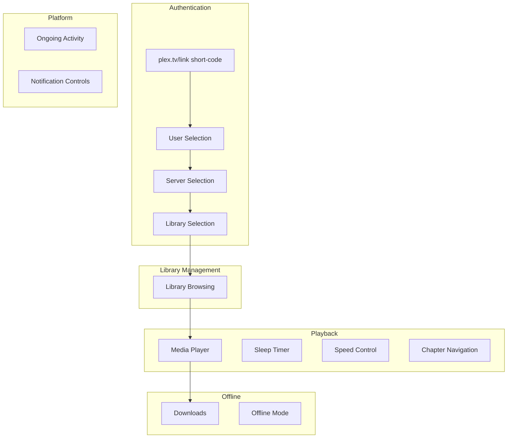
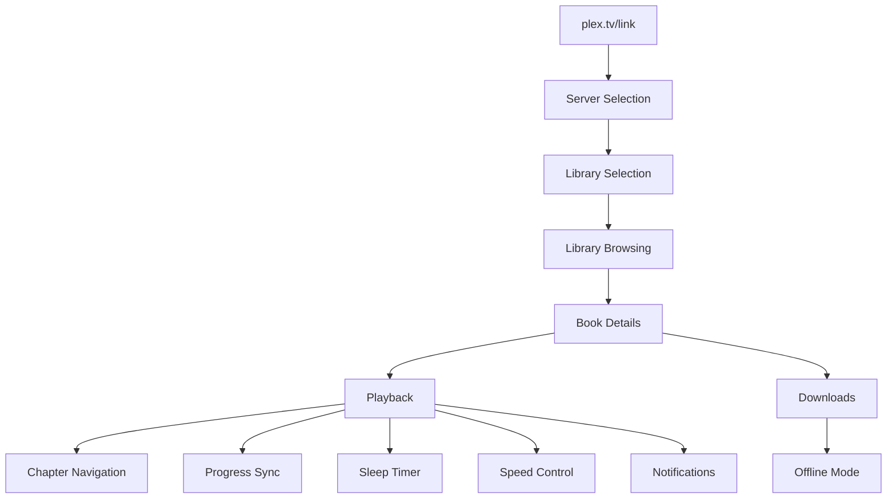

# Chronicle Features

## Overview

Chronicle is a standalone Wear OS audiobook player that integrates with Plex Media Server. This
document provides a high-level overview of Chronicle's features. For detailed information on
specific topics, see the documentation links below — several predate the Wear OS conversion and
are marked STALE; prefer [Wear OS UI](features/wear-ui.md) and
[Plex Sign-In](features/plex-link-login.md) where they conflict.

---

## Documentation Index

| Document | Description |
|----------|-------------|
| [Wear OS UI](features/wear-ui.md) | The ten Wear OS screens, nav routes, and Wear Compose components behind each |
| [Plex Sign-In](features/plex-link-login.md) | The plex.tv/link short-code sign-in flow |
| [Login & Authentication](features/login.md) | User/server/library selection state machine (STALE — phone-era UI; the underlying state machine is unchanged) |
| [Library & Browsing](features/library.md) | Library view, audiobook details (STALE — phone-era; Home/search/collections screens described here are gone) |
| [Media Playback](features/playback.md) | Player architecture, sleep timer, speed control, progress sync, notifications (STALE — phone-era UI, player internals mostly unchanged) |
| [Chapter System](features/chapters.md) | Chapter data flow, detection algorithm, track-to-chapter mapping, navigation (STALE — phone-era UI, detection logic unchanged) |
| [Offline Downloads](features/downloads.md) | Download management, storage, offline mode (STALE — phone-era; see [Wear OS Platform](architecture/wear-platform.md) for the Wear-specific storage guard) |
| [Settings](features/settings.md) | Configurable preferences and app settings (STALE — phone-era; see [Wear OS UI](features/wear-ui.md) for the rewritten Wear settings screen) |

---

## Feature Overview

Search, Collections, and a dedicated "filtering/sorting" UI were cut in the Wear OS conversion —
see [Wear OS UI](features/wear-ui.md) for the current screen set.

---

## Feature Summaries

### Authentication
Chronicle uses Plex's PIN-based authentication. On Wear OS this is the plex.tv/link short-code
flow: the watch displays a short code, the user enters it at plex.tv/link on any other device with
a browser, and the watch polls until it resolves. Users can then be prompted to select from
multiple managed users, servers, and libraries — the same underlying state machine
(`IPlexLoginRepo.LoginState`) the phone app used, just rendered by different screens.

→ See [Plex Sign-In](features/plex-link-login.md) (current) for the plex.tv/link flow, and
[Login & Authentication](features/login.md) (STALE — phone-era UI) for the user/server/library
selection state machine.

---

### Account Management
Chronicle's data layer still supports multiple Plex accounts and libraries
(`AccountManager`/`AccountRepository`/`CredentialManager`), and it remains wired into the login
flow. **There is no on-watch UI for switching accounts, users, or libraries after the initial
sign-in** — whichever account/user/server/library the plex.tv/link flow resolves to on first sign-in
is what's used; changing that requires logging out and re-running the link flow. The phone app's
account-list screen and library-selector bottom sheet were removed entirely.

→ See [Wear OS UI](features/wear-ui.md) for the current login/selection screens.

---

### Library & Browsing
The Wear OS app has a single `LibraryScreen` listing every audiobook across all connected
libraries — there is no separate Home, Search, or Collections screen on Wear OS (all three existed
on the phone app and were cut; see [Wear OS UI](features/wear-ui.md) for the reasoning). Tapping a
book opens its details/chapters screen.

→ See [Wear OS UI](features/wear-ui.md) (current) for the Wear screen set, and
[Library & Browsing](features/library.md) (STALE — describes the removed Home/Search/Collections
screens too) for background on the phone-era browsing features.

---

### Media Playback
Chronicle uses Media3 (ExoPlayer) for background audio playback with:
- Background playback support, with an Ongoing Activity indicator on Wear OS (see
  [Wear OS Platform](architecture/wear-platform.md))
- Sleep timer with shake-to-snooze
- Playback speed control (0.5x - 3.0x)
- Chapter navigation for M4B files
- Progress sync to Plex server
- Media notification controls
- Spoken (TTS) error announcements via the retained `VoiceCommandBridgeAudio` — see
  [Wear OS Platform](architecture/wear-platform.md)

> **Note:** `features/player/SleepTimer.kt`'s shake-to-snooze implementation imports
> `com.squareup.seismic.ShakeDetector`, but the `seismic` dependency this class comes from was
> removed from the build in the Wear OS conversion (it is not present in
> `gradle/libs.versions.toml` or `app/build.gradle.kts`). This looks like an unresolved gap between
> the build-file changes and `features/player/`, which the conversion otherwise left untouched —
> flagging here since it would surface as a compile failure on the first real build, not something
> observed by running the app.

→ See [Media Playback](features/playback.md) for player architecture and controls.

---

### Chapter System
Chronicle supports chapter navigation for M4B audiobooks and multi-file audiobooks:
- Chapters sourced from Plex API or synthesized from track files
- Sub-second Plex transition markers are skipped so duplicate `0:00` chapter rows are not shown
- Chapter-scoped seekbar and progress display
- Skip to next/previous chapter navigation
- Chapter list with active chapter highlighting

→ See [Chapter System](features/chapters.md) for detection algorithm and implementation details.

---

### Offline Downloads
Download audiobooks for offline playback:
- Background download with progress notifications
- Configurable storage location
- Offline mode for downloaded-only browsing
- Wear-specific: downloads are capped to one at a time, and a free-space check refuses a download
  that wouldn't fit rather than starting and failing partway through — see
  [Wear OS Platform](architecture/wear-platform.md)

→ See [Offline Downloads](features/downloads.md) (STALE — phone-era; doesn't cover the two
Wear-specific points above) for download management.

---

### Settings
A small, fixed set of Wear-appropriate rows (rewritten for this conversion — see
[Wear OS UI](features/wear-ui.md)):
- Offline mode
- Jump forward/backward intervals
- Auto-rewind
- Skip silent audio
- Pause on interruption/focus lost
- Refresh rate
- Delete downloaded files
- Log out
- Version/about

Everything else the phone app's settings screen had — premium, book-cover style, sync location,
Android Auto, subreddit/GitHub/licenses links, the debug-info Easter egg — was cut; there is no row
for any of it. Android Auto support itself (not just its settings row) was removed entirely in
this conversion.

→ See [Wear OS UI](features/wear-ui.md) (current) for the rewritten settings screen, and
[Settings](features/settings.md) (STALE — describes the larger cut phone-era preference list) for
background.

---

## Feature Dependencies

---

## Related Documentation

### Feature Details
- [Wear OS UI](features/wear-ui.md) - The current Wear OS screen set and nav routes
- [Plex Sign-In](features/plex-link-login.md) - The plex.tv/link auth flow
- [Login & Authentication](features/login.md) - User/server/library selection state machine (STALE — phone-era UI)
- [Library & Browsing](features/library.md) - Library and collections (STALE — phone-era; collections/search UI is gone)
- [Media Playback](features/playback.md) - Player and controls (STALE — phone-era UI)
- [Chapter System](features/chapters.md) - Chapter detection and navigation (STALE — phone-era UI)
- [Offline Downloads](features/downloads.md) - Download management (STALE — phone-era)
- [Settings](features/settings.md) - App preferences (STALE — phone-era; see Wear OS UI for the current screen)

### Architecture
- [Architecture Overview](ARCHITECTURE.md) - System architecture
- [Wear OS Platform](architecture/wear-platform.md) - Wear-specific platform concerns
- [Architecture Layers](architecture/layers.md) - Presentation, Domain, Data layers
- [Architectural Patterns](architecture/patterns.md) - Key patterns (STALE — phone-era)

### API & Data
- [API Flows](API_FLOWS.md) - Detailed API documentation
- [Data Layer](DATA_LAYER.md) - Database and repository patterns
- [Example API Responses](example-query-responses/) - Real Plex API examples
