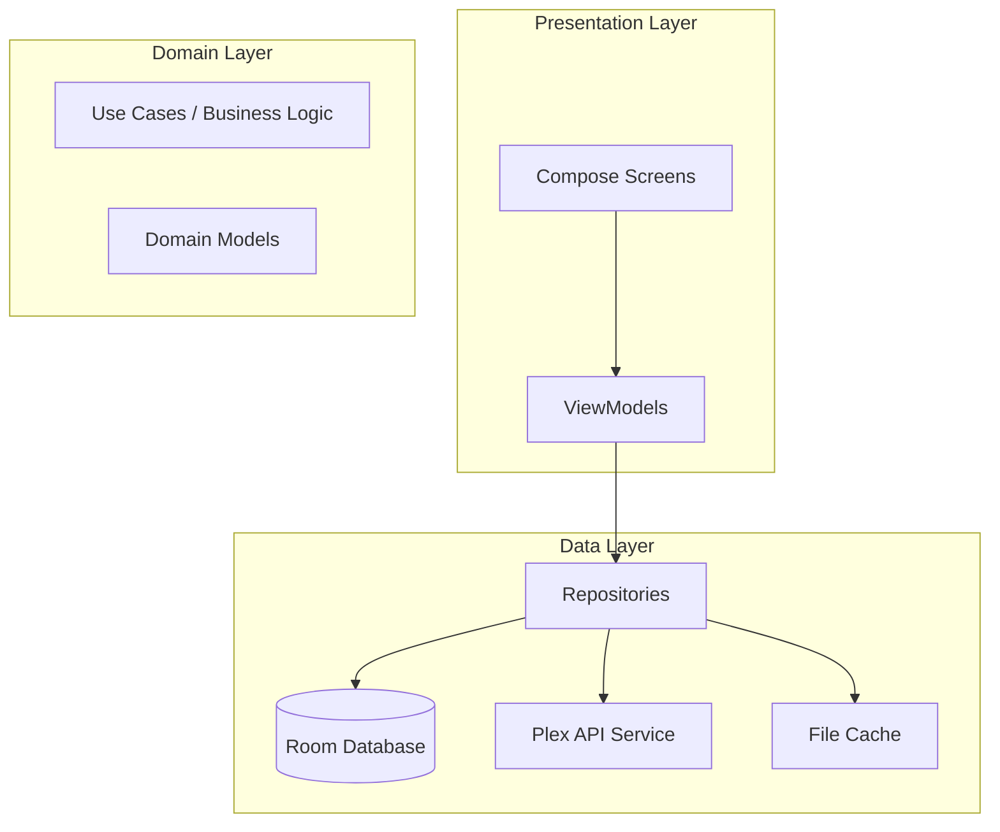
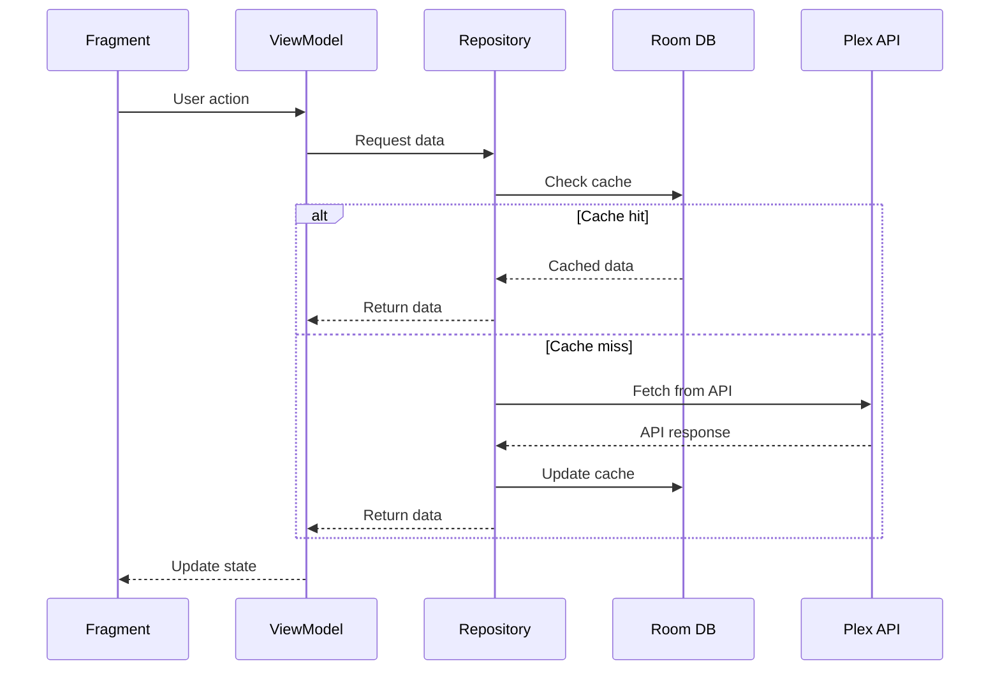

# Architecture Layers

This document describes the layered architecture of Chronicle, with details on each layer's responsibilities and key components.

For a high-level overview, see the [Architecture Overview](../ARCHITECTURE.md). For Wear-specific
platform concerns (rotary input, Ongoing Activity, etc.), see [Wear OS Platform](wear-platform.md).

## Overview

Chronicle follows a layered MVVM architecture with three primary layers. The presentation layer is
Compose for Wear OS — there are no Fragments:



---

## Presentation Layer

Composable screens are located in [`ui/`](../../app/src/main/java/local/oss/chronicle/ui/); their
ViewModels remain organized by feature under
[`features/`](../../app/src/main/java/local/oss/chronicle/features/). Each screen follows the MVVM
pattern: the composable renders state exposed by its ViewModel via `observeAsState()` and calls
ViewModel methods in response to user interaction, never navigating or mutating state directly.
See [`docs/features/wear-ui.md`](../features/wear-ui.md) for the full screen-by-screen writeup —
this section covers the general shape only.

### Screens and their ViewModels

| Screen (`ui/screens/`) | ViewModel (`features/`) | Purpose |
|---------|------|---------|
| `LinkAccountScreen` | `LoginViewModel` (`features/login/`) | plex.tv/link sign-in — see [Plex Sign-In](../features/plex-link-login.md) |
| `ChooseUserScreen` | `ChooseUserViewModel` (`features/login/`) | Managed/family user selection |
| `ChooseServerScreen` | `ChooseServerViewModel` (`features/login/`) | Plex server selection |
| `ChooseLibraryScreen` | `ChooseLibraryViewModel` (`features/login/`) | Library selection |
| `LibraryScreen` | `LibraryViewModel` (`features/library/`) | Full audiobook library |
| `BookDetailsScreen` | `AudiobookDetailsViewModel` (`features/bookdetails/`) | Audiobook details, chapters |
| `NowPlayingScreen`, `PlaybackSpeedScreen`, `SleepTimerScreen` | `CurrentlyPlayingViewModel` (`features/currentlyplaying/`) | Transport controls, speed, sleep timer |
| `SettingsScreen` | `SettingsViewModel` (`features/settings/`) | App preferences (rewritten for Wear — a small fixed row set, not the phone's ~40-row generic list) |

`features/player/` remains the MediaPlayerService/ExoPlayer integration (a service, not a screen).
`features/account/` and `features/auth/` are non-UI: account/credential data-layer classes and the
`PlexAuthCoordinator` state machine, respectively.

Collections, Home, and Search screens and their ViewModels were removed entirely — there is no
`features/collections/`, `features/home/`, or `features/search/` package anymore.

### Feature Module Structure

A typical feature package now contains just a `ViewModel` and its `Factory` — no Fragment, no
RecyclerView adapter, no `*BindingAdapters.kt`:

```
features/bookdetails/
└── AudiobookDetailsViewModel.kt     # State management + Factory
```

```
ui/screens/
└── BookDetailsScreen.kt             # @Composable — renders AudiobookDetailsViewModel's LiveData
```

---

## Domain Layer

The domain layer contains business logic and domain models. In Chronicle, business logic is primarily distributed between ViewModels and Repositories.

### Domain Models

Located in [`data/model/`](../../app/src/main/java/local/oss/chronicle/data/model/):

| Model | Purpose |
|-------|---------|
| [`Audiobook`](../../app/src/main/java/local/oss/chronicle/data/model/Audiobook.kt) | Core audiobook entity with metadata |
| [`MediaItemTrack`](../../app/src/main/java/local/oss/chronicle/data/model/MediaItemTrack.kt) | Individual audio track/file |
| [`Chapter`](../../app/src/main/java/local/oss/chronicle/data/model/Chapter.kt) | Chapter marker within a track |
| [`Collection`](../../app/src/main/java/local/oss/chronicle/data/model/Collection.kt) | Plex collection |
| [`PlexLibrary`](../../app/src/main/java/local/oss/chronicle/data/model/PlexLibrary.kt) | Plex library information |

### Business Logic Distribution

| Component | Responsibility |
|-----------|----------------|
| **ViewModels** | UI state management, user action handling, orchestrating repository calls |
| **Repositories** | Data access abstraction, caching strategy, sync logic |
| **Workers** | Background tasks (sync, downloads) |

---

## Data Layer

Located in [`data/`](../../app/src/main/java/local/oss/chronicle/data/)

The data layer handles all data operations, including local storage, remote API calls, and caching.

### Local Storage

Located in [`data/local/`](../../app/src/main/java/local/oss/chronicle/data/local/):

| Component | Purpose |
|-----------|---------|
| [`BookDatabase.kt`](../../app/src/main/java/local/oss/chronicle/data/local/BookDatabase.kt) | Room database for audiobook metadata |
| [`BookRepository.kt`](../../app/src/main/java/local/oss/chronicle/data/local/BookRepository.kt) | Audiobook data access |
| [`TrackDatabase.kt`](../../app/src/main/java/local/oss/chronicle/data/local/TrackDatabase.kt) | Room database for audio tracks |
| [`TrackRepository.kt`](../../app/src/main/java/local/oss/chronicle/data/local/TrackRepository.kt) | Track data access |
| [`ChapterDatabase.kt`](../../app/src/main/java/local/oss/chronicle/data/local/ChapterDatabase.kt) | Room database for chapters |
| [`ChapterRepository.kt`](../../app/src/main/java/local/oss/chronicle/data/local/ChapterRepository.kt) | Chapter data access |
| [`CollectionsDatabase.kt`](../../app/src/main/java/local/oss/chronicle/data/local/CollectionsDatabase.kt) | Room database for collections |
| [`CollectionsRepository.kt`](../../app/src/main/java/local/oss/chronicle/data/local/CollectionsRepository.kt) | Collection data access |
| [`SharedPreferencesPrefsRepo.kt`](../../app/src/main/java/local/oss/chronicle/data/local/SharedPreferencesPrefsRepo.kt) | App preferences storage |

### Remote Data Sources

Located in [`data/sources/plex/`](../../app/src/main/java/local/oss/chronicle/data/sources/plex/):

| Component | Purpose |
|-----------|---------|
| [`PlexService.kt`](../../app/src/main/java/local/oss/chronicle/data/sources/plex/PlexService.kt) | Retrofit API interface |
| [`PlexMediaRepository.kt`](../../app/src/main/java/local/oss/chronicle/data/sources/plex/PlexMediaRepository.kt) | Plex content access |
| [`PlexLoginRepo.kt`](../../app/src/main/java/local/oss/chronicle/data/sources/plex/PlexLoginRepo.kt) | Authentication handling |
| [`PlexConfig.kt`](../../app/src/main/java/local/oss/chronicle/data/sources/plex/PlexConfig.kt) | Server configuration |
| [`PlexInterceptor.kt`](../../app/src/main/java/local/oss/chronicle/data/sources/plex/PlexInterceptor.kt) | HTTP header injection |

### File Cache

| Component | Purpose |
|-----------|---------|
| [`CachedFileManager.kt`](../../app/src/main/java/local/oss/chronicle/data/sources/plex/CachedFileManager.kt) | Manages cached/downloaded audio files |

---

## Data Flow



---

## Related Documentation

- [Architecture Overview](../ARCHITECTURE.md) - High-level architecture diagrams
- [Wear OS Platform](wear-platform.md) - Rotary input, Ongoing Activity, and other Wear specifics
- [Wear OS UI](../features/wear-ui.md) - Screen-by-screen breakdown
- [Dependency Injection](dependency-injection.md) - Dagger component hierarchy (STALE — phone-era; component shape is unchanged)
- [Architectural Patterns](patterns.md) - Key patterns used in Chronicle (STALE — phone-era)
- [Plex Integration](plex-integration.md) - Plex-specific implementation details (STALE — phone-era)
